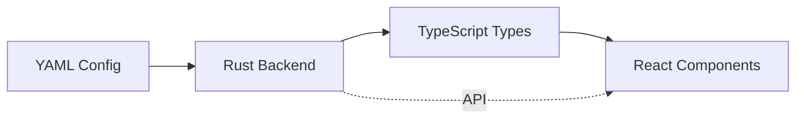

# Rust-form

> **Declarative, Type-Safe Full-Stack Web Applications in Rust**

[](https://opensource.org/licenses/MIT)
[](https://www.rust-lang.org)

Rust-form is a powerful code generator that creates complete, production-ready web applications from simple YAML configurations. Define your data models, API endpoints, and UI components once, and generate both a high-performance Rust backend and a modern TypeScript frontend with perfect type safety between them.

## ⚡ Quick Start

```yaml
# blog.yml
project:
  name: "blog_api"

models:
  Post:
    fields:
      id: { type: "uuid", primary_key: true }
      title: { type: "string" }
      content: { type: "text" }
      published: { type: "boolean", default: false }

frontend:
  target: "react"
  generate_ui_for: ["Post"]
```

```bash
rustform generate blog.yml
cd blog_api && cargo run
# 🚀 Full-stack blog app running on http://localhost:8080
```

## 🌟 Features

### **Backend Generation**
- **High-Performance Rust** - Axum web framework with SQLx database integration
- **Type-Safe APIs** - Automatic CRUD endpoints with compile-time verification
- **Multiple Databases** - SQLite, PostgreSQL, MySQL support
- **Production Ready** - Error handling, logging, middleware, CORS

### **Frontend Generation** 
- **Multi-Framework** - React, Vue, Svelte support with auto-discovery
- **Perfect Type Safety** - TypeScript generated directly from Rust backend
- **Modern Stack** - React Query, Zod validation, Tailwind CSS
- **Opt-in Components** - Generate only what you need, customize the rest

### **Full-Stack Type Safety**


## 🎯 Philosophy

**Convention over Configuration** - Sensible defaults, minimal boilerplate
**Type Safety First** - Catch errors at compile time, not runtime  
**Developer Experience** - From idea to running app in minutes
**Production Ready** - Generate code you'd write by hand
**Extensible** - Plugin architecture for custom templates and frameworks

## 📦 Installation

```bash
# Install from source (for now)
git clone https://github.com/rust-form/rust-form.git
cd rust-form
cargo install --path rustform-cli

# Verify installation
rustform --version
```

## 🚀 Getting Started

### 1. Create a Configuration

```yaml
# todo.yml
project:
  name: "todo_app"
  description: "A simple todo application"

database:
  type: "sqlite"
  url_env: "DATABASE_URL"

server:
  port: 8080

models:
  Todo:
    fields:
      id:
        type: "uuid"
        primary_key: true
        default: "gen_random_uuid()"
      title:
        type: "string"
        validation:
          min_length: 1
          max_length: 200
      description:
        type: "text"
        optional: true
      completed:
        type: "boolean"
        default: false
      created_at:
        type: "datetime"
        default: "now()"

frontend:
  target: "react"
  typescript_output_dir: "../frontend/src/generated"
  generate_ui_for: ["Todo"]
```

### 2. Generate Your Application

```bash
rustform generate todo.yml
```

This creates:
```
todo_app/
├── backend/              # Rust backend
│   ├── src/
│   │   ├── main.rs       # Axum server
│   │   ├── models.rs     # Todo struct with TS generation
│   │   ├── handlers.rs   # CRUD API endpoints  
│   │   └── database.rs   # SQLx integration
│   └── Cargo.toml
└── frontend/             # TypeScript frontend
    ├── src/
    │   ├── generated/
    │   │   ├── types/    # Auto-generated from Rust
    │   │   └── components/ # Todo form & list
    │   └── App.tsx
    └── package.json
```

### 3. Run Your Application

```bash
# Start backend
cd todo_app/backend
cargo run

# Start frontend (in another terminal)
cd todo_app/frontend  
npm install && npm run dev
```

Visit `http://localhost:3000` to see your generated Todo app! 🎉

## 🏗️ Architecture

Rust-form uses a three-crate workspace architecture:

- **`rustform-cli`** - Command-line interface and project orchestration
- **`rustform-codegen`** - Template engine and code generation  
- **`rustform-core`** - Configuration parsing and validation

### Template Auto-Discovery

Templates are automatically discovered from directory structure:

```
components/
├── frontend/
│   ├── react/          # Auto-discovered React templates
│   ├── vue/            # Auto-discovered Vue templates  
│   └── svelte/         # Auto-discovered Svelte templates
└── backend/
    ├── basic/          # Current CRUD backend
    ├── auth/           # Future: Auth-enhanced backend
    └── graphql/        # Future: GraphQL backend
```

## 🎨 Frontend Frameworks

Rust-form supports multiple frontend frameworks with identical APIs:

### React
```yaml
frontend:
  target: "react"
  framework_config:
    react:
      state_management: "react-query"
      styling: "tailwind"
      forms: "react-hook-form"
```

### Vue  
```yaml
frontend:
  target: "vue"
  framework_config:
    vue:
      composition_api: true
      state_management: "pinia"
      styling: "tailwind"
```

### Svelte
```yaml
frontend:
  target: "svelte"
  framework_config:
    svelte:
      state_management: "svelte-store"
      styling: "tailwind"
```

**Switch frameworks instantly** by changing the `target` field!

## 🔄 Type Safety Pipeline

```mermaid
graph TD
    A[YAML Config] --> B[Rust Structs with #[derive(TS)]]
    B --> C[Cargo Build]
    C --> D[TypeScript Interfaces]
    D --> E[React Components]
    B --> F[Axum API Endpoints]
    E -.->|HTTP Requests| F
    F -.->|JSON Responses| E
```

The backend becomes the **single source of truth** for types. TypeScript interfaces are generated directly from Rust structs using [ts-rs](https://github.com/Aleph-Alpha/ts-rs), ensuring perfect synchronization.

## 📚 Examples

- **[Todo App](examples/todo.yml)** - Simple CRUD application
- **[Blog Platform](examples/blog.yml)** - Multi-model relationships  
- **[E-commerce](tests/future_configs/ecommerce-advanced.yml)** - Complex business logic
- **[Social Media](tests/future_configs/social-media.yml)** - Real-time features
- **[CMS](tests/future_configs/cms-platform.yml)** - Content management

## 🛠️ Development Status

**Current Status: MVP Complete ✅**

- ✅ Multi-model CRUD generation
- ✅ SQLx database integration  
- ✅ Axum web framework
- ✅ TypeScript type generation
- ✅ React component generation
- ✅ Template auto-discovery

**Coming Soon:**

- 🔄 Enhanced relationship handling
- 🔄 Advanced validation rules
- 🔄 Vue and Svelte support
- 🔄 Authentication & authorization
- 🔄 Real-time features
- 🔄 GraphQL support

## 🤝 Contributing

We welcome contributions! See [CONTRIBUTING.md](CONTRIBUTING.md) for guidelines.

### Quick Contribution Areas

- **Templates** - Add support for new frameworks by creating template directories
- **Features** - Implement enhancements from our [roadmap](ai/tasks.json)
- **Documentation** - Improve guides and add examples
- **Testing** - Add test cases for edge cases

## 📖 Documentation

- **[Getting Started](docs/GETTING_STARTED.md)** - Detailed tutorial
- **[Configuration Reference](docs/CONFIG_REFERENCE.md)** - Complete YAML schema  
- **[Frontend Generation](docs/FRONTEND_GENERATION.md)** - Frontend framework guide
- **[Architecture](docs/ARCHITECTURE.md)** - Technical deep dive
- **[Templates](docs/TEMPLATES.md)** - Custom template development

## 🔗 Related Projects

- **[Supabase](https://supabase.com)** - Backend-as-a-service with TypeScript generation
- **[Prisma](https://prisma.io)** - Database toolkit with type generation
- **[tRPC](https://trpc.io)** - End-to-end type safety for APIs
- **[PostgREST](https://postgrest.org)** - Auto-generated REST APIs from PostgreSQL

## 📄 License

This project is licensed under the MIT License - see the [LICENSE](LICENSE) file for details.

## 🌟 Star History

[](https://star-history.com/#rust-form/rust-form&Date)

---

**Built with ❤️ by the Rust-form team**

[Website](https://rust-form.dev) • [Documentation](https://docs.rust-form.dev) • [Discord](https://discord.gg/rust-form) • [Twitter](https://twitter.com/rustform)