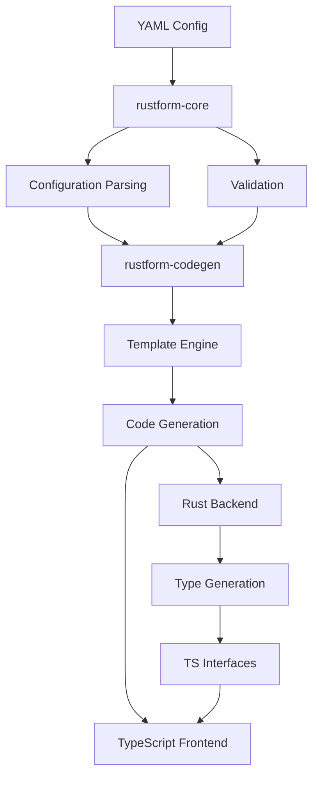
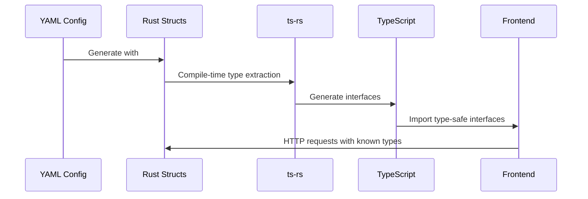

# Architecture

This document provides a comprehensive overview of Rust-form's architecture, design decisions, and technical implementation.

## 🏗️ System Overview

Rust-form is designed as a modular, extensible code generation platform that transforms declarative YAML configurations into full-stack web applications.



## 📦 Workspace Structure

Rust-form uses a Cargo workspace with three main crates:

```
rust-form/
├── rustform-cli/          # Command-line interface
├── rustform-codegen/      # Template engine and generation
├── rustform-core/         # Core types and configuration
└── components/            # Auto-discovered templates
    ├── frontend/
    │   ├── react/
    │   ├── vue/
    │   └── svelte/
    └── backend/
        ├── basic/
        ├── auth/
        └── graphql/
```

## 🔧 Core Components

### 1. rustform-cli

**Purpose**: Command-line interface and project orchestration

**Key Responsibilities**:
- CLI argument parsing with `clap`
- Project initialization and management
- Orchestrating the generation pipeline
- Error reporting with `miette`

**Main Components**:
```rust
// CLI entry point
pub struct Cli {
    #[command(subcommand)]
    pub command: Commands,
}

pub enum Commands {
    Generate(GenerateArgs),
    Init(InitArgs),
    Validate(ValidateArgs),
}
```

### 2. rustform-core

**Purpose**: Shared types, configuration parsing, and validation

**Key Responsibilities**:
- YAML configuration schema definition
- Configuration parsing and validation
- Database connection management
- Shared error types and utilities

**Core Types**:
```rust
// Main configuration structure
pub struct Config {
    pub project: ProjectConfig,
    pub database: DatabaseConfig,
    pub server: ServerConfig,
    pub models: HashMap<String, ModelConfig>,
    pub frontend: Option<FrontendConfig>,
}

// Model definition
pub struct ModelConfig {
    pub fields: HashMap<String, FieldConfig>,
    pub relationships: Option<Vec<RelationshipConfig>>,
    pub validation: Option<ValidationConfig>,
}
```

### 3. rustform-codegen

**Purpose**: Template engine and code generation

**Key Responsibilities**:
- Template auto-discovery and loading
- Context building for template rendering
- Multi-framework code generation
- TypeScript type generation integration

**Template Engine**:
```rust
// Template discovery system
pub fn discover_templates() -> Result<TemplateRegistry> {
    let mut registry = TemplateRegistry::new();
    
    // Auto-discover frontend frameworks
    for entry in fs::read_dir("components/frontend")? {
        let framework = load_framework_templates(&entry.path())?;
        registry.register_frontend(framework);
    }
    
    // Auto-discover backend variants
    for entry in fs::read_dir("components/backend")? {
        let backend = load_backend_templates(&entry.path())?;
        registry.register_backend(backend);
    }
    
    Ok(registry)
}
```

## 🎨 Template System

### Auto-Discovery Architecture

Templates are automatically discovered based on directory structure, eliminating the need for manual registration:

```
components/
├── frontend/
│   ├── react/              # Framework name = directory name
│   │   ├── meta.toml       # Framework metadata
│   │   ├── components/     # Component templates
│   │   └── config/         # Build configuration
│   └── vue/
└── backend/
    ├── basic/              # Backend variant = directory name
    │   ├── meta.toml       # Variant metadata
    │   └── templates/      # Rust templates
    └── auth/
```

### Template Context System

Templates receive a rich context object containing all necessary data:

```rust
pub struct TemplateContext {
    pub project: ProjectContext,
    pub models: Vec<ModelContext>,
    pub database: DatabaseContext,
    pub frontend: Option<FrontendContext>,
}

pub struct ModelContext {
    pub name: String,
    pub fields: Vec<FieldContext>,
    pub primary_key_type: String,
    pub relationships: Vec<RelationshipContext>,
}
```

### Template Engine (Tera)

Uses [Tera](https://tera.netlify.app/) templating engine with custom filters:

```rust
// Custom filters for code generation
fn setup_tera_filters(tera: &mut Tera) {
    tera.register_filter("snake_case", snake_case_filter);
    tera.register_filter("pascal_case", pascal_case_filter);
    tera.register_filter("camel_case", camel_case_filter);
    tera.register_filter("plural", pluralize_filter);
}
```

Example template usage:
```rust
// models.rs.tera

#[derive(Debug, Clone, Serialize, Deserialize, TS)]
#[ts(export, export_to = "{{ frontend.typescript_output_dir }}/types/")]
pub struct {{ model.name | pascal_case }} {
    
    pub {{ field.name }}: {{ field.rust_type }},
    
}

```

## 🔄 Type Safety Pipeline

### End-to-End Type Flow



### TypeScript Generation

Uses [ts-rs](https://github.com/Aleph-Alpha/ts-rs) for automatic TypeScript generation:

```rust
// Generated Rust struct
#[derive(Debug, Clone, Serialize, Deserialize, TS)]
#[ts(export, export_to = "../frontend/src/generated/types/")]
pub struct User {
    pub id: uuid::Uuid,
    #[serde(skip_serializing_if = "Option::is_none")]
    pub phone: Option<String>,
    pub created_at: chrono::DateTime<chrono::Utc>,
}
```

Automatically generates:
```typescript
// user.ts
export interface User {
  id: string;
  phone?: string;
  created_at: string;
}
```

## 🗄️ Database Architecture

### Multi-Database Support

```rust
pub enum DatabaseType {
    Sqlite,
    Postgres,
    MySQL,
}

pub trait DatabaseAdapter {
    fn connection_string(&self) -> String;
    fn migration_sql(&self, model: &ModelConfig) -> String;
    fn type_mapping(&self, field_type: &FieldType) -> String;
}
```

### SQLx Integration

- **Compile-time verification** of SQL queries
- **Connection pooling** for performance
- **Migration management** with automatic table creation

```rust
// Generated database setup
pub async fn setup_database(database_url: &str) -> Result<SqlitePool> {
    let pool = SqlitePool::connect(database_url).await?;
    run_migrations(&pool).await?;
    Ok(pool)
}

pub async fn run_migrations(pool: &SqlitePool) -> Result<()> {
    sqlx::migrate!("./migrations").run(pool).await?;
    Ok(())
}
```

## 🎨 Frontend Architecture

### Multi-Framework Support

Each framework is treated as a plugin with its own template directory:

```rust
pub struct FrameworkConfig {
    pub name: String,
    pub file_extension: String,
    pub dependencies: Vec<Dependency>,
    pub build_config: BuildConfig,
}

pub trait FrontendFramework {
    fn generate_component(&self, model: &ModelContext) -> Result<String>;
    fn generate_config(&self, project: &ProjectContext) -> Result<String>;
    fn install_dependencies(&self) -> Result<()>;
}
```

### Component Generation

Components are generated based on model configuration:

```yaml
# Configuration
frontend:
  target: "react"
  generate_ui_for: ["User", "Post"]
  components:
    User:
      form_fields: ["name", "email"]
      list_columns: ["name", "email", "created_at"]
      features: ["create", "edit", "delete"]
```

Generates:
- `UserForm.tsx` - Create/edit form component
- `UserList.tsx` - Data table with pagination
- `UserCard.tsx` - Individual item display
- `useUser.ts` - React Query hooks for API calls

## 🛡️ Error Handling

### Structured Error Types

```rust
#[derive(Debug, thiserror::Error)]
pub enum RustFormError {
    #[error("Configuration error: {0}")]
    Config(#[from] ConfigError),
    
    #[error("Template error: {0}")]
    Template(#[from] TemplateError),
    
    #[error("Database error: {0}")]
    Database(#[from] sqlx::Error),
    
    #[error("IO error: {0}")]
    Io(#[from] std::io::Error),
}
```

### User-Friendly CLI Errors

Uses [miette](https://github.com/zkat/miette) for beautiful error reporting:

```rust
// Example error with source location
return Err(miette!(
    labels = vec![
        LabeledSpan::at(span, "invalid field type"),
    ],
    help = "Valid types are: string, i32, bool, uuid, datetime",
    "Unsupported field type: {}", field_type
));
```

## 🚀 Performance Considerations

### Code Generation Performance

- **Template Caching**: Compiled templates are cached for reuse
- **Parallel Generation**: Independent files generated concurrently
- **Incremental Updates**: Only regenerate changed components

### Runtime Performance

- **Axum Framework**: High-performance async web framework
- **SQLx**: Compile-time checked queries with connection pooling
- **Zero-Copy Serialization**: Efficient JSON handling with Serde

## 🔧 Extension Points

### Adding New Frontend Frameworks

1. Create directory: `components/frontend/your-framework/`
2. Add `meta.toml` with framework configuration
3. Create component templates
4. Framework automatically discovered and available

### Adding Backend Variants

1. Create directory: `components/backend/your-variant/`
2. Add Rust templates for your backend style
3. Configure in YAML: `backend: { variant: "your-variant" }`

### Custom Template Filters

```rust
// Add to rustform-codegen/src/engine.rs
pub fn register_custom_filter(tera: &mut Tera) {
    tera.register_filter("your_filter", |value: &Value, _: &HashMap<String, Value>| {
        // Your transformation logic
        Ok(Value::String(transformed))
    });
}
```

## 🧪 Testing Strategy

### Unit Tests
- Configuration parsing validation
- Template rendering accuracy
- Type generation correctness

### Integration Tests
- End-to-end generation pipeline
- Generated code compilation
- Multi-framework compatibility

### Property-Based Testing
- YAML configuration fuzzing
- Template context validation
- Type safety verification

## 📈 Future Architecture Enhancements

### Planned Improvements

1. **Plugin System**: External template packages
2. **Hot Reloading**: Watch mode for development
3. **Schema Validation**: JSON Schema for YAML configs
4. **Performance Profiling**: Generation time optimization
5. **Caching Layer**: Persistent template and context caching

### Scalability Considerations

- **Microservice Generation**: Multiple backend services
- **Database Sharding**: Multi-database configurations
- **CDN Integration**: Asset optimization and deployment
- **Monitoring**: Built-in observability and metrics

## 🔗 Dependencies

### Core Dependencies
- **clap**: CLI argument parsing
- **serde**: Serialization/deserialization
- **tokio**: Async runtime
- **sqlx**: Database interaction
- **tera**: Template engine
- **miette**: Error reporting

### Generated Code Dependencies
- **axum**: Web framework
- **tower**: Middleware
- **ts-rs**: TypeScript generation
- **uuid**: UUID support
- **chrono**: Date/time handling

This architecture provides a solid foundation for extensible, maintainable, and performant full-stack code generation.